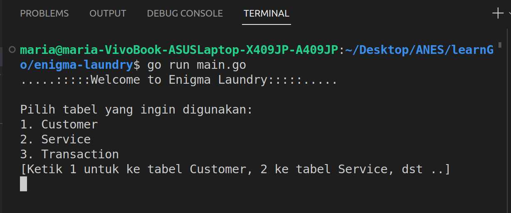
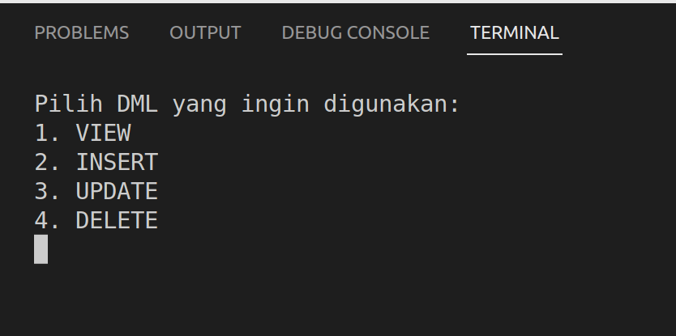
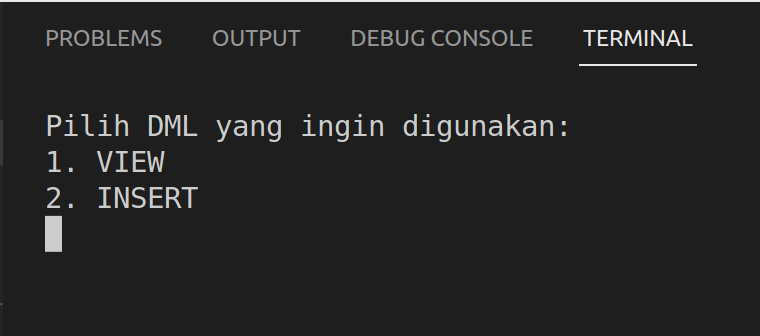
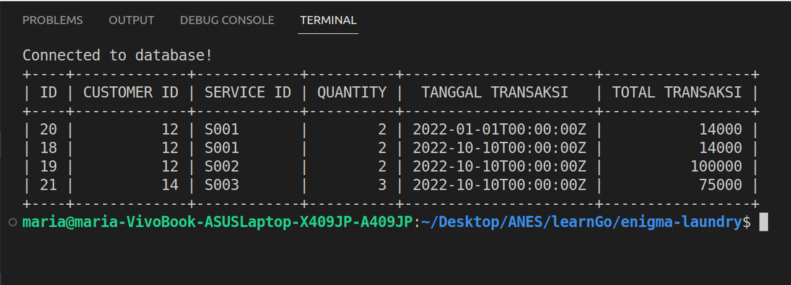
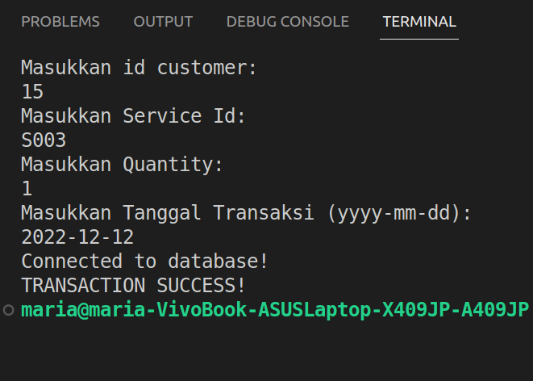
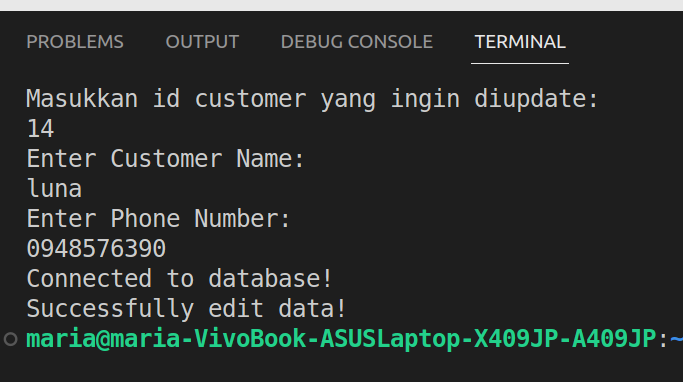

Dokumentasi Project Enigma Laundry
Agnes Maria Anggelina

About Project: 

Project ini dibuat dengan menggunakan bahasa pemrograman Go dan PostgreSQL sebagai databasenya. 

Cara menjalankan Program Enigma Laundry:

A) Buka teriminal kemudian jalankan perintah go run main.go, kemudian akan tampil
pilihan tabel seperti di bawah ini: 

User dapat menginput angka 1 untuk menuju ke tabel customer, 2 untuk ke tabel service dan 3 untuk menuju ke tabel transaksi. 

B) JIka user menuju ke tabel master yaitu tabel Customer dan Service, maka user akan diberikan pilihan untuk VIEW, INSERT, UPDATE, dan DELETE data

C) Jika user menuju ke tabel transaksi, user hanya akan diberikan pilihan untuk VIEW dan INSERT data

D) Jika user menginput angka 1 untuk ke menu VIEW make akan ditampilkan data dari database dengan format tabel yang diperoleh dari package github.com/olekukonko/tablewriter

E) Jika user memilih menu INSERT, maka user dapat memasukkan data melalu console 

F) Jika user memilih menu UPDATE, maka user harus memasukkan id data yang 
ingin diedit

G) Jika user memilih menu DELETE, maka user juga harus memasukkan id data
yang ingin didelete

